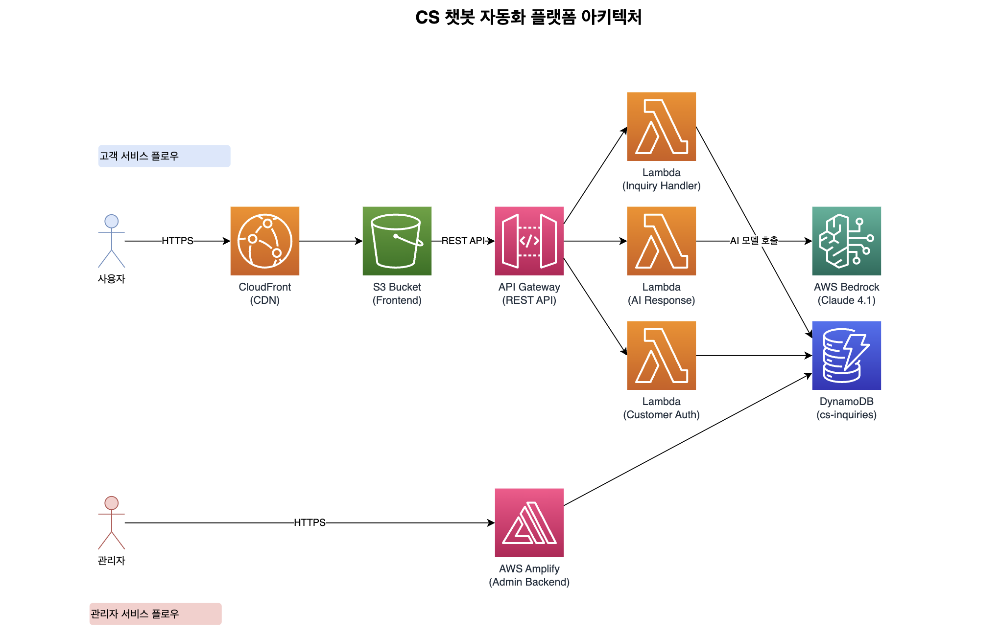

# 🤖 CS 챗봇 자동화 플랫폼
**Team 03** | **Amazon Q Developer로 구현한 지능형 고객 서비스 솔루션**

> 💡 **핵심 가치**: 월 300만원 CS 인건비를 9만원으로, AI가 24시간 고객 응대

## 👥 Team 03 구성
**전문성 기반 역할 분담으로 효율적 협업**

- **🔧 Backend 개발자**: Python/AWS Lambda 전문
- **🎨 Frontend 개발자**: React/Next.js 전문  
- **🚀 Full-stack 개발자**: 통합 개발 담당
- **☁️ Infrastructure 개발자**: AWS CDK & CI/CD 전문

## 🎯 해결하고자 하는 문제

### 340만 소규모 사업장의 공통 고민

**타겟 시장**: 10인 미만 소규모 사업장 (국민연금 기준 전체의 85%, 약 340만개)

### 핵심 Pain Points
- CS 인력 부족 (월 300만원+ 인건비)
- 반복 문의로 인한 업무 과부하
- 핵심/중요 업무 집중도 저하
- 24시간 대응 불가능

### 시장 규모
- **국내 CS 솔루션 시장 3000억 원 이상**
- 급성장하는 자동화 시장

## 🚀 우리의 솔루션
**AI 기반 실시간 문의 자동 처리 시스템**

### 고객의 CS 운영 비용 절감
- **운영 비용**: 기존 월 300만원 → 9만원
- **연간 절약**: 3,000만원+

### 핵심 기능
- **🚀 즉시 응답**: Claude 4.1 Opus 기반 지능형 답변
- **📊 통합 관리**: 관리자 대시보드 모니터링
- **🔄 어드민 기능**: 추가 예정

## 🏗️ 시스템 아키텍처
**AWS 네이티브 서버리스 구조**



### 핵심 기술 스택
- **Frontend**: Next.js 14 (TypeScript) + Tailwind CSS
- **Backend**: Python 3.11 + AWS Lambda (서버리스)
- **AI Engine**: AWS Bedrock (Claude 4.1 Opus)
- **Database**: DynamoDB (GSI 최적화)
- **Infrastructure**: AWS CDK (Infrastructure as Code)
- **CI/CD**: GitHub Actions + OIDC 인증

### 배포 전략
- **Infrastructure as Code**: AWS CDK
- **원클릭 배포**: `./deploy.sh`

## 🎬 라이브 데모
**고객 문의 처리 플로우**


1. **문의 접수**: 고객이 웹 폼을 통해 문의 작성
2. **AI 응답**: Claude 4.1 기반 맞춤형 답변 (평균 2초 내 응답 완료)
3. **에스컬레이션**: AI 답변 불만족 시 원클릭 실제 상담 연결

**실시간 진행 상황 추적 가능**

## 🤖 Amazon Q Developer 혁신 활용

### 창의적 활용 사례

#### 1️⃣ 협업 규칙 생성
- 4명 개발자 공통/직군별 `.amazonq/rules`, `docs` 작성
- **팀 전체 코딩 스타일 통일**

#### 2️⃣ 프롬프트 엔지니어링
- CS 도메인 특화 AI 응답 로직 **TDD, DDD 기반 구현**

#### 3️⃣ 인프라 최적화
- CDK + CloudFormation으로 **인프라 프로비저닝 + 배포 자동화**

### AI 개발 플로우
**Spec-Driven TDD 방식**

```
📝 Requirements → 🧪 Test → ✅ Pass → ♻️ Refactor
```

#### 규칙 기반 개발
- `backend-rules.md`: TDD, Clean Architecture
- `frontend-rules.md`: TypeScript, React 패턴
- `project-context.md`: 비즈니스 도메인 정의

#### 차별화 포인트
- 단순 코드 생성이 아닌 **팀 협업 방식 혁신**
- **도메인 특화** AI 프롬프트 엔지니어링
- **인프라까지 포함한** 풀스택 자동화

## 💰 비즈니스 가치 & 실용성

### 수익성 분석
- **기존**: CS 인건비 월 300만원+
- **도입 후**: AI 솔루션 월 9만원
- **절감률**: 연 3,000만원+ 절약

### ROI
- 도입 첫 달부터 즉시 효과

### 확장 전략
1. 온라인 쇼핑몰, 소규모 SaaS
2. 추가 예정

## 📊 핵심 성과 지표

### 사용 사례
- 🛒 **이커머스**: 주문/배송/환불 자동 처리
- 💻 **SaaS**: 기술 지원 및 사용법 안내
- 🏦 **금융**: 계좌/카드 FAQ 즉시 응답
- 📱 **통신**: 요금/서비스 실시간 처리

## 🌟 차별화 포인트

### 기존 솔루션 vs 우리 솔루션

| 기존 솔루션 | 우리 솔루션 |
|------------|------------|
| 정해진 질문에만 답변 | 상황 맞춤형 AI 답변 |
| 별도 시스템 구축 필요 | AWS 네이티브 통합 |
| 높은 초기 비용 | 사용량 기반 합리적 요금 |
| 복잡한 설치 과정 | 원클릭 배포 |

### 핵심 경쟁력
**간편한 도입** • **지능형 학습** • **완전 자동화** • **비용 효율성**

## 🚀 배포하기

### 사전 요구사항
- **Python 3.8+** ([다운로드](https://www.python.org/downloads/))
- **Node.js 18+** ([다운로드](https://nodejs.org/))
- **AWS CLI** ([설치 가이드](https://docs.aws.amazon.com/cli/latest/userguide/getting-started-install.html))

### 원클릭 배포
```bash
git clone https://github.com/PRO-HUNTER-X/team03-aws-hackathon
cd team03-aws-hackathon/infra
python setup.py 
./deploy.sh
```

## 🎯 혁신적 임팩트

**Amazon Q Developer로 구현한 지능형 CS 솔루션**

- **타겟 임팩트**: 340만 소규모 사업장의 CS 혁신
- **경제적 효과**: 연 3,000만원+ 비용 절감 효과
- **기술 혁신**: AI 기반 24시간 고객 서비스 실현

### 미래 비전
**고객 서비스의 디지털 전환을 선도하는 플랫폼**

---

**🏆 Amazon Q Developer Hackathon 2025 - Team 03**  
*혁신적인 AI 기술로 고객 서비스의 미래를 만들어갑니다*
