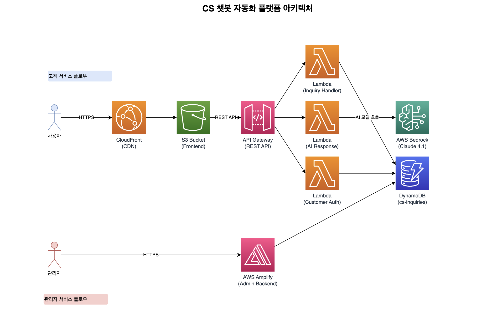

<!-- _class: lead -->
# 🤖 CS 챗봇 자동화 플랫폼
**월 300만원 CS 인건비를 9만원으로**
AI가 24시간 고객 응대

**Team 03** | **Amazon Q Developer Hackathon 2025**

---

# Team 03 구성
**전문성 기반 역할 분담으로 효율적 협업**

### 🔧 Backend 개발자
- Python/AWS Lambda 전문

### 🎨 Frontend 개발자
- React/Next.js 전문

### 🚀 Full-stack 개발자
- 통합 개발 담당

### ☁️ Infrastructure 개발자
- AWS CDK & CI/CD 전문

---

# 해결하고자 하는 문제
## 340만 소규모 사업장의 공통 고민

### 🎯 타겟 시장
- **10인 미만 소규모 사업장** (국민연금 기준 전체의 85%, 약 340만개)

### 💸 핵심 Pain Points
- CS 인력 부족 (월 300만원+ 인건비)
- 반복 문의로 인한 업무 과부하
   -  핵심/ 중요 업무 집중도 저하

### 📊 시장 규모
- **국내 CS 솔루션 시장 3000억 원 이상**
- 급성장하는 자동화 시장

---

# 우리의 솔루션
## AI 기반 실시간 문의 자동 처리 시스템

### 🚀 운영 비용 절감
- **운영 비용**: 월 300만원 → 9만원
- **연간 절약**: 3,000만원+

### 🚀 즉시 응답
- Claude 4.1 Opus 기반 지능형 답변

### 🔄 어드민 기능
- 추가 예정

### 📊 통합 관리
- 관리자 대시보드 모니터링

---

# 아키텍처 - AWS 네이티브 서버리스 구조

### 🚀 배포 전략
- **Infrastructure as Code**: AWS CDK
- **원클릭 배포**: `./deploy.sh`

---

# 라이브 데모
## 고객 문의 처리 플로우

### 1️⃣ 문의 접수
고객이 웹 폼을 통해 문의 작성

### 2️⃣ AI 응답
Claude 4.1 기반 맞춤형 답변
평균 2초 내 응답 완료

### 3️⃣ 에스컬레이션
AI 답변 불만족 시
원클릭 실제 상담 연결

**실시간 진행 상황 추적 가능**

---

# Amazon Q Developer 혁신 활용
## 창의적 활용 사례

### 1️⃣ 협업 규칙 생성
- 4명 개발자 공통/직군별 `.amazonq/rules`, `docs` 작성
  -  **팀 전체 코딩 스타일 통일**

### 2️⃣ 프롬프트 엔지니어링
- CS 도메인 특화 AI 응답 로직 **TDD, DDD 기반 구현**

### 3️⃣ 인프라 최적화
- CDK + CloudFormation으로 **인프라 프로비저닝 + 배포 자동화**

---

# 🤖 AI 개발 플로우
## Spec-Driven TDD 방식

📝 Requirements → 🧪 Test →  ✅ Pass → ♻️ Refactor

### 📋 규칙 기반 개발
- `backend-rules.md`: TDD, Clean Architecture
- `frontend-rules.md`: TypeScript, React 패턴
- `project-context.md`: 비즈니스 도메인 정의

### 💡 차별화 포인트
- 단순 코드 생성이 아닌 **팀 협업 방식 혁신**
- **도메인 특화** AI 프롬프트 엔지니어링
- **인프라까지 포함한** 풀스택 자동화

---

# 비즈니스 가치 & 실용성
## 수익성 분석

### 💰 고객 비용 절감
- **기존**: CS 인건비 월 300만원+
- **도입 후**: AI 솔루션 월 9만원
  - **절감률**: (연 3,000만원+ 절약)

### 📈 ROI
- 도입 첫 달부터 즉시 효과

### 🚀 확장 전략
1. 온라인 쇼핑몰, 소규모 SaaS
- 추가 예정

---

# 핵심 성과 지표
## 정량적 효과

### 📊 성능 지표
- 추가 예정

### 🎯 사용 사례
- 🛒 **이커머스**: 주문/배송/환불 자동 처리
- 💻 **SaaS**: 기술 지원 및 사용법 안내
- 🏦 **금융**: 계좌/카드 FAQ 즉시 응답
- 📱 **통신**: 요금/서비스 실시간 처리

---

# 차별화 포인트
## 기존 솔루션 vs 우리 솔루션

### ❌ 기존 솔루션
- 정해진 질문에만 답변
- 별도 시스템 구축 필요
- 높은 초기 비용
- 복잡한 설치 과정

### ✅ 우리 솔루션
- 상황 맞춤형 AI 답변
- AWS 네이티브 통합
- 사용량 기반 합리적 요금
- 원클릭 배포

### 🏆 핵심 경쟁력
**간편한 도입** • **지능형 학습** • **완전 자동화** • **비용 효율성**

---

# 마무리
## 혁신적 임팩트

**Amazon Q Developer로 구현한 지능형 CS 솔루션**

### 🎯 타겟 임팩트
- 340만 소규모 사업장의
CS 혁신

### 💰 경제적 효과
- 연 3,000만원+
비용 절감 효과

### 🚀 기술 혁신
- AI 기반 24시간
고객 서비스 실현

**미래 비전**: 고객 서비스의 디지털 전환을 선도하는 플랫폼

---

<!-- _class: lead -->
# 감사합니다
### 03_프로 헌터스
